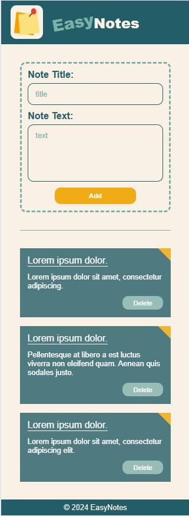

### softteco-task
# 📌📝 EasyNotes ✏️📅

## Table of contents
  - [Project Title](#easynotes)
  - [Overview](#overview)
  - [The Project](#the-project)
  - [Technology stack](#technology-stack)
  - [Links](#links)
  - [Installation Instructions](#installation-instructions)
  - [Visuals](#visuals)
  - [Project Status](#project-status)
  - [Author](#author)

## Overview

### The Project
A responsive, user friendly application for creating simple notes.

### Technology stack
- HTML
- CSS
- JavaScript
- React.js

### Links
- Source code repository URL: [Github](https://github.com/basiacarvalho/softteco-test-trainee)
- Live Site URL: [Live demo](https://basiacarvalho.github.io/softteco-test-trainee/)

### Installation Instructions
In the project directory, you can run:

### `npm start`

Runs the app in the development mode.\
Open [http://localhost:3000](http://localhost:3000) to view it in your browser.

The page will reload when you make changes.\
You may also see any lint errors in the console.

### Visuals

### Project Status
- Completed (with the possiblity for future adaption)
The basic concepts of the project have been met, however further ideas may be implemented and added in the future.

### Author
- Barbara Carvalho 👩‍💻
